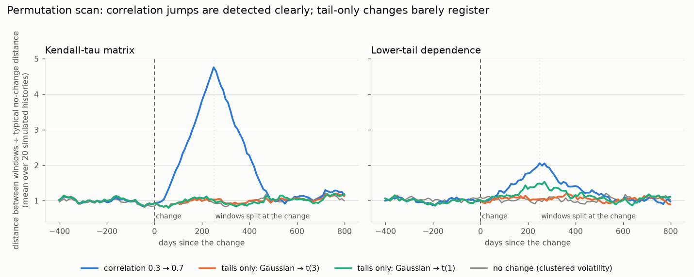

# Dynamic Vine Copula Risk Monitoring

A quantitative risk framework for estimating and monitoring time-varying dependence
structures in financial markets using rolling vine copula models.

The project investigates how pairwise and higher-order dependence, particularly tail
dependence, evolves over time and whether statistically meaningful changes in the
dependence structure can be detected. The resulting dependence models are subsequently
used to investigate implications for portfolio tail risk.

This is a research project, not a trading strategy.

> **Status: work in progress.** All ten phases are implemented (data, marginals, static
> vine, rolling estimation, dependence monitoring, structural change detection,
> portfolio risk, synthetic validation study, dashboard, simulated live monitor),
> and six demonstration notebooks show how to use them (see section 5).
> See [Status](#10-status).

---

## 1. The idea in plain language

Stocks do not move independently. A **copula** is a way to describe *how* several
assets move together, separately from how each asset moves on its own. This matters
most in crashes, where assets often fall together far more often than ordinary
correlation suggests (this is called **tail dependence**).

With many assets, one big copula is hard to estimate, so we use a **vine copula**: it
builds the joint dependence out of many simple two-asset pieces ("pair-copulas")
arranged in a sequence of trees.

The project does this:

1. Take daily prices of a few liquid assets and turn them into returns.
2. Look at a **rolling window** (for example the last 250 trading days) and fit a vine
   copula to it.
3. Slide the window forward one day and fit again, over the whole history.
4. Track how the fitted dependence changes, decide which changes are real and which are
   just estimation noise, and see how portfolio risk (VaR, Expected Shortfall) reacts.

Central question: *how does the dependence structure of a multi-asset portfolio evolve
over time, and can meaningful changes in dependence and tail dependence be detected?*

---

## 2. Setup

You need **Python 3.10 or newer**. (Check with `python3 --version`; on macOS the
default `python3` can be older, so you may need to name a newer one, e.g. `python3.12`.)

```bash
# 1. Go to the project folder
cd Quant_copula

# 2. Create a virtual environment: a private folder (.venv) holding this project's
#    Python packages, so they don't clash with other projects on your computer.
python3.12 -m venv .venv

# 3. Activate it. Your terminal prompt should now show (.venv).
#    You must do this in every new terminal window.
source .venv/bin/activate

# 4. Install this project and its dependencies (what the brackets mean is explained below).
#    "dev" adds the test tool, "dashboard" adds Streamlit, "notebooks" adds JupyterLab.
pip install -e ".[dev,dashboard,notebooks]"

# 5. Check that everything works: runs the automated tests
pytest
```

Without activating, you can call the environment's Python directly, e.g.
`.venv/bin/python scripts/run_rolling.py` and `.venv/bin/pytest`.

### Running the rolling estimation

```bash
python scripts/run_rolling.py                       # settings from configs/default.yaml
python scripts/run_rolling.py --window 125          # a different window size
python scripts/run_rolling.py --last 350            # quick test on the last 350 days
```

The first run downloads prices from Yahoo Finance and caches them in `data/cache/`.
Fitting about 5,000 windows takes roughly an hour on 4 CPU cores. Progress is saved
as it goes, so if you stop the script and start it again it **resumes** where it left
off. Results end up in `data/results/w<window>/` as `.parquet` files (see
[Glossary](#9-glossary)).

After a run finishes, compute the monitoring metrics:

```bash
python scripts/compute_metrics.py                   # reads data/results/w250/checkpoint.jsonl
```

This writes `dependence_metrics.parquet` (one row per date: average absolute Kendall tau
`d_t`, Spearman/Pearson, model-implied lower/upper tail dependence, how much the vine
structure changed since the previous fit, AIC/BIC, ...) plus `pairwise_*.parquet`
tables with one column per asset pair.

**Tail dependence in this project.** `lower_tail_q` is the probability that asset *j*
is in its worst 5% of days given that asset *i* is, as implied by the fitted vine
(`q` = `tail_level` in the config). It is a finite-level version of the textbook tail
coefficient, so it is positive even for copulas with no asymptotic tail dependence; use
it to compare dates, not as an absolute truth. It is estimated by simulating from each
fitted vine with the same random numbers every time, so changes between dates come from
the model, not from simulation noise.

---

## 3. Project structure

If you are used to single scripts, the main difference here is that the reusable code
lives in a **package** (a folder of modules you `import`), and everything else
(scripts, tests, settings) sits around it and *uses* that package.

```
Quant_copula/
├── README.md              This file.
├── pyproject.toml         The project's "ID card": name, version, dependencies. (see below)
├── LICENSE                Terms under which others may use the code (MIT).
├── .gitignore             Files git should not track (the .venv, downloaded data, ...).
│
├── configs/
│   └── default.yaml       Settings: which tickers, window size, truncation level, ...
│
├── src/
│   └── vine_risk/         <-- THE PACKAGE: all the real code lives here.
│       ├── config.py          Reads default.yaml into typed Python objects.
│       ├── data.py            Downloads prices (with caching) and cleans them.
│       ├── returns.py         Prices -> log returns -> model-ready return matrix.
│       ├── marginals.py       Turns returns into uniform numbers in (0,1) via ranks.
│       ├── copula.py          VineCopula: fits a vine and summarises it.
│       ├── dependence.py      Pairwise tau/Spearman/Pearson and the monitoring metrics.
│       ├── rolling.py         RollingVineModel: the rolling-window machinery.
│       ├── pipeline.py        Small helpers that chain the data steps (used by the notebooks).
│       ├── monitor.py         LiveMonitor: sequential monitoring with alerts (simulated live).
│       ├── portfolio.py       Loss, VaR, Expected Shortfall from simulated scenarios.
│       ├── change_detection.py Structural change scores and the calibrated permutation test.
│       ├── synthetic.py       Simulated data with known dependence regimes.
│       ├── validation.py      The synthetic validation study (experiments, metrics).
│       ├── dashboard_data.py  Loads a finished run for the dashboard (no Streamlit inside).
│       ├── dashboard_figures.py The nine dashboard charts (Plotly), light and dark theme.
│       └── visualization.py   Plots (prices, uniformity check, vine trees).
│
├── dashboard/
│   └── app.py             The Streamlit dashboard (thin: widgets and layout only).
│
├── scripts/
│   ├── run_rolling.py     Command-line entry point to run the rolling fit.
│   ├── compute_metrics.py Turns a finished run into dependence_metrics.parquet.
│   ├── detect_changes.py  Structural change scores and permutation-test scan.
│   ├── compute_risk.py    Rolling portfolio VaR / ES and a VaR backtest.
│   ├── run_live.py        Simulated live monitoring: replay history day by day.
│   ├── run_validation.py  The synthetic validation study (about 30 minutes).
│   └── plot_validation.py Figure for the validation study.
│
├── notebooks/             Six Jupyter notebooks that teach the package step by step (see section 5).
│
├── tests/                 Automated checks of the maths and the code (run with pytest).
│
├── data/
│   ├── cache/             Downloaded prices (auto-created, not in git).
│   └── results/           Output of the rolling runs (auto-created, not in git).
│
└── reports/
    ├── figures/           Saved figures and example outputs.
    └── validation/        Result tables of the synthetic validation study (CSV).
```

Planned modules that do not exist yet: `diagnostics.py`.

### Why is the code in `src/vine_risk/` and not next to the scripts?

Putting the code in a package means any script, test or notebook can simply write
`from vine_risk.rolling import RollingVineModel` without fiddling with file paths.
The extra `src/` level is a common convention that stops you from accidentally
importing the code from the wrong place.

### What is `pyproject.toml`?

A **TOML** file is just a plain-text settings file with simple `key = value` lines and
`[sections]`. `pyproject.toml` is the standard file where a Python project describes
itself. Ours says:

- the project's name (`vine-risk`) and version;
- which other packages it needs (`dependencies`: numpy, pandas, pyvinecopulib, ...);
- optional extras: `dev` (adds `pytest` for testing), `dashboard` (adds Streamlit and Plotly) and `notebooks` (adds JupyterLab);
- where the code lives (`src/`), and where the tests are.

When you run `pip install -e ".[dev,dashboard,notebooks]"`, pip reads this file, installs all the listed
packages, and registers `vine_risk` so it can be imported from anywhere in this
environment.

- `.` means "the project in the current folder".
- `-e` ("editable") means pip links to your files instead of copying them, so edits
  you make to the code take effect immediately without reinstalling.
- `[dev,dashboard,notebooks]` selects the extra groups of packages with these names (you can list any subset).

### What is `configs/default.yaml`?

**YAML** is another plain-text settings format (indentation-based). We keep settings
here instead of hard-coding them in Python, so you can change the analysis without
touching code. For example:

```yaml
assets: [AAPL, MSFT, NVDA, JPM, XOM, JNJ, SPY, TLT]   # replace with any tickers
rolling:
  window: 250            # trading days per fit
  refit_frequency: 1     # 1 = refit every day, 5 = every 5th day
  truncation_level: 3    # only fit the first 3 trees of the vine (null = all)
  n_jobs: 4              # CPU cores to use
```

### What is `.gitignore`?

A list of files git should leave alone: the `.venv` folder (large and specific to your
machine), downloaded data and result files (they can be regenerated), and Python
temporary files such as `__pycache__`.

### What are `tests/`?

Small programs that check the code against cases where the right answer is known (for
example: log returns against hand-computed values, Kendall's tau against SciPy,
recovery of a known copula from simulated data). `pytest` finds and runs all of them.
If you change something and the tests still pass, you probably did not break anything.

---

## 4. How the pieces fit together

```
Yahoo Finance prices
        |   data.py         download + cache + clean
        v
  adjusted prices
        |   returns.py      log returns, handle missing data
        v
  return matrix R   (T days x d assets)
        |   marginals.py    rank / (T+1)   ->  numbers strictly between 0 and 1
        v
  uniform data U
        |   copula.py       fit a vine copula (pyvinecopulib)
        v
  VineFitResult  --  family, parameters, tail dependence, AIC/BIC, structure, ...
        |   rolling.py      repeat for every window, store one result per date
        v
  tables (.parquet): fits / pair_copulas / pairwise
```

Design choices worth knowing:

- **Log returns, not prices.** Copulas are fitted to returns, using adjusted prices so
  splits and dividends do not create fake jumps.
- **Ranks instead of a distribution model for each asset.** The first version uses
  the simple rank transform `u = rank(r) / (T + 1)`. `marginals.py` defines an
  interface (`Marginal`) so a Student-t or GARCH version can be dropped in later
  without touching the copula code.
- **A mature library for the vine itself.** We use
  [pyvinecopulib](https://vinecopulib.github.io/pyvinecopulib/) (a Python interface to
  a C++ library) instead of writing our own. Pair-copula families are chosen
  automatically using BIC (a score that penalises unnecessarily complex models).
- **No look-ahead.** The result stamped with date *t* only uses data up to and
  including *t*, and the rank transform is re-done inside each window. Tests check
  this.
- **Results are plain data, not model objects.** Each fit is summarised in a
  `VineFitResult` (a plain Python dataclass that converts to JSON), so results can be
  saved, reloaded and compared later.
- **Updating data is separate from refitting the model.** `RollingVineModel.push()`
  adds a new observation; `refit()` fits the model. This lets the same code handle
  daily refits, periodic refits, and later the "live" mode.

---

## 5. Learn by doing: the notebooks

The quickest way to see what the package does is to run the notebooks in `notebooks/`. A *notebook* is a document in which
text and code alternate; you run the code cell by cell and see the tables and plots appear below it.

```bash
pip install -e ".[notebooks]"      # once, adds JupyterLab (skip if you installed all extras in section 2)
jupyter lab                        # opens a browser; open a notebook from the notebooks/ folder
```

Run them in order. Each starts with what it teaches and what it needs, and every code cell has been executed, so you can also
read them on GitHub without running anything.

| Notebook | You learn | Needs | Time |
|----------|-----------|-------|------|
| `01_data_exploration` | settings, prices, cleaning, log returns, why returns are not normal; using your own tickers | internet once (prices are cached) | 1 min |
| `02_static_vine` | marginal transform, fitting one vine, reading families, tau and tail dependence, tree plots, simulation, model options | notebook 1 | 1 min |
| `03_rolling_vine` | the rolling window, what is stored per date, stepwise versus batch, window-length sensitivity; **creates a small demo run** in `data/results/demo/` | notebook 2 | 2-3 min |
| `04_dependence_changes` | dependence over time, which pairs moved, structure churn, why one-day comparisons fail, the permutation test, alerts, simulated experiments with a known answer | demo run or full run | 2 min |
| `05_portfolio_risk` | VaR and Expected Shortfall, vine versus simpler models, your own weights, the backtest, dependence versus volatility | demo run or full run | 1 min |
| `06_live_monitor` | feeding prices one day at a time, resuming from saved state, checking against the batch run, the alert rule | demo run or full run | 1 min |

Notebooks 4 to 6 use the full 20-year run (`data/results/w250/`) if it exists and the small demo run otherwise, so they work
either way; with the full run the plots cover 2006-2026. To make the full run: `python scripts/run_rolling.py` (about an
hour), then `compute_metrics.py`, `detect_changes.py` and `compute_risk.py` (section 6 to 8).

---

### Using the package from Python (short version)

```python
from vine_risk.config import load_config
from vine_risk.data import download_prices
from vine_risk.returns import build_return_matrix
from vine_risk.marginals import EmpiricalMarginal
from vine_risk.copula import VineCopula

cfg = load_config("configs/default.yaml")
prices = download_prices(cfg.assets, cfg.data.start, cfg.data.end, cfg.data.cache_dir)
returns = build_return_matrix(prices)                 # T x d table of log returns

window = returns.iloc[-250:]                          # the last 250 days
u = EmpiricalMarginal().fit_transform(window)         # uniform data

result = VineCopula(truncation_level=3).fit(u, window).summary()
print(result.pair_copula_frame())                     # families, parameters, tail dependence
print(result.tau_matrix())                            # Kendall's tau between all assets
```

Rolling version (use inside an `if __name__ == "__main__":` block when `n_jobs > 1`):

```python
from vine_risk.rolling import RollingVineModel, save_results

model = RollingVineModel.from_config(cfg)
results = model.run(returns, n_jobs=4, checkpoint="data/results/run.jsonl")
save_results(results, "data/results/run")
```

---

## 6. Detecting structural change

A fitted vine always moves a little from day to day, mostly because of estimation
noise. The project therefore asks a statistical question: *is the dependence in the
latest window different from the dependence in the window before it by more than noise
alone would explain?*

```bash
python scripts/detect_changes.py        # after run_rolling.py; writes two parquet files
```

- `structural_change_scores.parquet`: for every date, `structural_change_score` (the
  Frobenius distance between the Kendall-tau matrix now and one window ago, the "S_t"
  of the project brief) plus a model-based distance and some diagnostics.
- `change_scan.parquet`: every 5th day, a **permutation test** comparing the latest
  window with the one before it. Observations (in blocks of 10 days) are randomly
  shuffled between the two windows many times to learn how large the difference looks
  when nothing has changed. Statistics: the whole tau matrix, and the lower and upper
  tail dependence, each as an "any pair changed" and an "average over pairs" version. The
  file also has effect sizes (`stat_*` relative to `null_mean_*`) and Benjamini-Hochberg
  corrected flags, because many dates are tested.

### 6.1 Does it work? The synthetic validation study

Before trusting any result on real stocks, the detectors were run on simulated data
where the truth is known (`src/vine_risk/validation.py`, `python scripts/run_validation.py`,
about 30 minutes; every number below is in `reports/validation/*.csv`). Four assets, 250-day
windows, 20 simulated histories per experiment, change at day 900 of 1,700. An alert is
`p <= 0.01`. *False alarm* is the share of dates without any change that raised an alert;
*power* is the share of dates raising an alert in the stretch where the two compared
windows straddle the change.



| Experiment | False alarms | Power (tau matrix) | Power (best tail statistic) | Histories with a detection |
|------------|-------------:|-------------------:|----------------------------:|---------------------------:|
| A: constant dependence | 0-1% | n/a | n/a | n/a |
| A': constant dependence, clustered volatility | 1% | n/a | n/a | n/a |
| B: correlation jumps 0.3 → 0.7 | 1-2% | **94%** | 46% | 100% |
| C1: Gaussian → Student-t(3), same Kendall tau | 1% | 0% | 3% | 5% (tau) to 30% (tail) |
| C2: Gaussian → Student-t(1), same Kendall tau | 1% | 2% | 21% | 10% (tau) to 60% (tail) |

What this means:

- **The permutation test keeps its promise**: about 1% false alarms at the 1% level,
  also when volatility clusters.
- **Correlation changes are found reliably**, typically about 115 days (about half a
  window) after they happen.
- **Tail-only changes are mostly invisible** to every statistic here. Only a very
  strong tail change (C2, tail coefficient 0 to 0.5 at unchanged Kendall tau) is picked
  up, and then only in about half of the histories. The moderate one (C1) is not
  detectable with 250 daily observations: each window holds about 25 tail observations
  per asset, and the gap in tail dependence (0.33 vs 0.40 at the 10% level) is about the
  size of the sampling noise.
- **Distance scores from the rolling vine fits** (`structural_change_scores`) have no
  built-in null distribution, so their thresholds were calibrated by simulation (99th
  percentile of the no-change experiment). Calibrated on the harder volatility-clustering
  null, the Kendall-tau distance has 100% power in B (but 3% in C2), and the
  model-implied distance, which also uses the fitted tail dependence, has 74% in B and
  32% in C2 with about 0% false alarms. It is the more sensitive to tail changes, at
  the price of needing this calibration. Calibrated only on data *without* volatility
  clustering, the thresholds are too low and false alarms rise to 3-10% when volatility
  clusters.
- **Comparing consecutive days is useless**: the one-step distance (the literal "S_t"
  of the brief) has only 1-6% power in B because neighbouring windows share 249 of 250
  observations. Comparing with the window one year earlier is what works.
- **The z-score** of the disjoint-window distance (`z > 3`) is well calibrated (about
  1% false alarms) but has only 24% power in B: the baseline absorbs the shift. The
  **CUSUM** of the average dependence detects B (82% power) but keeps alarming after
  the change, because it never resets (31% "false alarms" are mostly that), and finds
  nothing in the tail experiments.

How well does the fitted vine recover the truth? (`reports/validation/estimation_accuracy.csv`,
40 histories per window length; true copula Student-t(3) with the same marginals)

| Window | Lower-tail coefficient (RMSE) | 99% ES: vine | 99% ES: Gaussian copula | 99% ES: historical |
|-------:|------------------------------:|-------------:|------------------------:|-------------------:|
| 125 | 25% | bias -6%, RMSE 13% | bias -12%, RMSE 15% | bias -14%, RMSE 18% |
| 250 | 14% | bias +3%, RMSE 11% | bias -7%, RMSE 10% | bias -2%, RMSE 12% |
| 500 | 7% | bias +2%, RMSE 7% | bias -8%, RMSE 9% | bias -1%, RMSE 9% |

A Gaussian copula underestimates the expected shortfall by 7-8% when the truth has tail
dependence, which is real but smaller than the estimation noise of a single 250-day
window (about 10%). With a Gaussian truth the vine costs a little accuracy
(ES RMSE 9.6% vs 7.6% at 250 days). Historical simulation from a short window
underestimates the 99% tail (bias -2% to -14% for windows up to 250 days).

### 6.2 What the detectors say about the real data

On the real 8-asset data (window 250, 2006-2026), with the calibrated permutation test:

- The Kendall-tau matrix differs significantly from the year before on about 39% of
  scan dates (30% after multiple-testing correction). Dependence is clearly not
  constant, but effect sizes are modest: typically 1.6 times the no-change noise level,
  at most 3.4.
- Much of this is the whole market becoming more or less correlated together (the tau
  distance correlates 0.86 with the change in average dependence).
- Tail-dependence changes are rarely significant (3-10% of dates raw, none after
  correction). The study above shows why this is weak evidence of "no change": even a
  strong tail change (C2) is missed in about half of the simulated histories.
- None of this establishes *why* dependence changed. These are associations with
  periods in the calendar, not causal statements.

---

## 7. The dashboard

```bash
pip install -e ".[dashboard]"            # adds streamlit and plotly (once)
streamlit run dashboard/app.py           # opens http://localhost:8501
```

It reads the files that the scripts in `scripts/` wrote into `data/results/w250/` (set another
folder in the sidebar, or with the environment variable `VINE_RISK_RUN_DIR`). It needs at
least the output of `run_rolling.py` and `compute_metrics.py`; a panel whose file is missing
says which script to run instead of failing.

| Panel | Shows | Needs |
|-------|-------|-------|
| 1 Asset prices / returns | selected assets, rebased prices on a log scale or daily log returns | `run_rolling.py` (prices come from the local cache) |
| 2 Rolling dependence | average absolute Kendall tau D_t, optionally with Pearson and lower tail | `compute_metrics.py` |
| 3 Pairwise dependence | heatmap of Kendall tau between all pairs on a chosen date | `compute_metrics.py` |
| 4 Dependence evolution | Kendall tau of two chosen assets through time | `compute_metrics.py` |
| 5 Tail dependence | the fitted vine's lower and upper tail dependence for the same pair | `compute_metrics.py` |
| 6 Vine structure | the fitted vine on the chosen date, tree by tree; hover an edge for family, tau and tail dependence | `run_rolling.py` |
| 7 Structural-change score | one of four scores, with the periods above an adjustable threshold shaded | `detect_changes.py` |
| 8 Portfolio risk | rolling 99% Expected Shortfall or VaR for the vine copula and three benchmarks, plus the VaR backtest | `compute_risk.py` |
| 9 Live monitor replay | the alert history of a simulated live run | `run_live.py` |

Charts are interactive (hover for exact values) and follow the light or dark theme of
Streamlit. "Show data tables" in the sidebar lists the numbers behind every chart. The threshold
in panel 7 only shades periods on screen: it is a visual aid and not a significance
level, so use the p-values in `change_scan.parquet` (section 6) for decisions.

---

## 8. The live monitor (simulated)

The monitor is the "live" mode of the project: it receives **one observation at a time**
and, after each, reports updated dependence metrics, a comparison with the previous model, a
change score and an alert state. There is no connection to a market-data provider; instead,
history is *replayed* day by day, which makes the whole system testable and reproducible.

```bash
python scripts/run_live.py --days 120                      # replay the last 120 days
python scripts/run_live.py --start 2023-11-20 --end 2024-02-15
```

What happens for every new price (`src/vine_risk/monitor.py`, class `LiveMonitor`):

```
new price -> log return -> update the rolling window -> refit if due (refit_frequency)
          -> dependence metrics (D_t, tails, vine structure changes vs the previous fit)
          -> distance to the model one window earlier
          -> permutation test of the last two windows (every 5th day)
          -> alert state -> record (console, JSON log, table)
```

The script first *primes* the monitor with the history before the start date and the fits
already saved in `checkpoint.jsonl`, exactly as a real system would resume from saved state,
so a replay of 120 days costs 120 refits (about a second each) and not 5,000.

**Alerts** come from the permutation test of section 6, because it is calibrated and does not
depend on the number of assets. An alert *starts* when the Kendall-tau matrix of the latest
window differs significantly (p <= 1%) from the one before **and** the difference is at
least 2 times what noise alone produces; it *ends* when that factor falls below 1.5. Using two
levels stops the alert from flickering around a single cut-off. On the real data this gives 11
alert episodes in 20 years (one every two years or so), against about 40% of scan dates that are
individually significant, because with a year of data even small differences are significant.
These thresholds (2.0 and 1.5) are conventions, not estimated quantities; change them in
`MonitorConfig`.

**No look-ahead, verified.** After the replay, the script compares the monitor's output with
the batch results stored in the run folder (`--no-verify` skips this). On the real data the
replays match to rounding error (differences of 0 to 1e-18) for the metrics, the change scores,
the permutation tests and the VaR/ES numbers, for example:

```
alert state at the start: normal
2023-12-14 [alert] D_t=0.207 ES=2.22% ** ALERT ** dependence differs from the previous window
    (tau-matrix distance 2.2x the no-change level, p=0.002)
60 observations, 60 refits in 75s; 1 new alert(s); final state: alert
  OK   m_d_t         vs dependence_metrics.parquet            60 dates, max abs diff 0.00e+00
  OK   scan_p_tau    vs change_scan.parquet                   12 dates, max abs diff 0.00e+00
  OK   risk_es_vine  vs portfolio_risk.parquet                12 dates, max abs diff 0.00e+00
PASS: the live replay reproduces the batch results
```

The automated tests (`tests/test_monitor.py`) also check that running on a prefix of the data
gives the same records as the full run, and that resuming from a checkpoint gives the same
records as running continuously. Outputs go to `<run>/live/` (`live_log.jsonl` with every
record as it happens, `live_log.parquet`, `live_alerts.csv`), and panel 9 of the dashboard
shows them.

Things to know: the monitor is not a trading signal; an alert says that the dependence of
the last year differs from the year before, not why; resuming from saved fits needs the
alert state as well (the script derives it from the stored scans, otherwise an ongoing alert
would be reported as new); and the first alert can only come after `2 x window` observations.

---

## 9. Glossary

| Term | Meaning |
|------|---------|
| Log return | `log(P_t / P_{t-1})`: the daily price change in a form that adds up over time. |
| Copula | A description of how variables depend on each other, independent of their individual distributions. |
| Vine copula | A joint copula assembled from many two-variable copulas arranged in trees. |
| Pair-copula | One two-variable building block of a vine, e.g. a "Clayton" or "Gaussian" copula. |
| Kendall's tau / Spearman | Rank-based measures of how strongly two assets move together (-1 to 1). |
| Tail dependence | Probability that two assets are extreme *together* (lower tail: crashes, upper tail: rallies). |
| AIC / BIC | Scores that balance how well a model fits against how complex it is; lower is better. |
| Truncation level | Fit only the first *k* trees of the vine; deeper trees are usually small and noisy. |
| VaR / ES | Value at Risk and Expected Shortfall: standard measures of portfolio tail loss. |
| Permutation test | Shuffle observations between two windows many times to see how big a difference looks by chance alone. |
| Multiple testing / FDR | Testing many dates yields some "significant" results by luck; Benjamini-Hochberg limits the expected share of false discoveries. |
| Parquet | A compact file format for tables; read with `pandas.read_parquet`. |
| Virtual environment | A private folder of installed packages for one project (`.venv`). |
| Editable install | `pip install -e`: makes the package importable while still using your live source files. |

---

## 10. Status

| Phase | Content | State |
|------|---------|-------|
| 1 | Data download, cleaning, log returns | done |
| 2 | Marginals (rank transform) | done |
| 3 | Static vine copula, structured results, tree plot | done |
| 4 | Rolling estimation (checkpointed, parallel) | done |
| 5 | Dependence monitoring metrics (average tau, changes, tail dependence) | done |
| 6 | Structural change detection | done |
| 7 | Portfolio risk (VaR, ES) | done |
| 8 | Synthetic validation study | done |
| 9 | Streamlit dashboard | done |
| 10 | Live (replay) simulation | done |

## 11. Limitations (to be extended)

- A rolling window describes *local* history; financial dependence is not stationary.
- Different vine structures can have nearly identical likelihoods, so structure changes
  can be noise.
- Looking at many pairs and many dates will produce some "unusual" changes by chance.
- In a vine, the tau and tail dependence of pair-copulas beyond the first tree are
  *conditional* on other assets; they are not the plain pairwise values.
- A detected statistical change is not automatically an economic regime change, and
  associations found here are not causal claims.
- The permutation test treats blocks of 10 days as exchangeable; longer-lasting serial
  dependence still makes it somewhat too liberal, and it only says that two windows
  differ, not when inside them the change happened.
- Tail-dependence changes of realistic size are hard to detect with one or two years of
  daily data; a non-significant tail test is weak evidence of "no change".
- Moving-window comparisons at neighbouring dates are not independent tests, so the
  multiple-testing correction is approximate.
- The live monitor is a replay of history. A real feed would bring late, missing or revised
  prices, which the monitor rejects (it raises an error) rather than repairs.
- Daily data only; no intraday dynamics.
