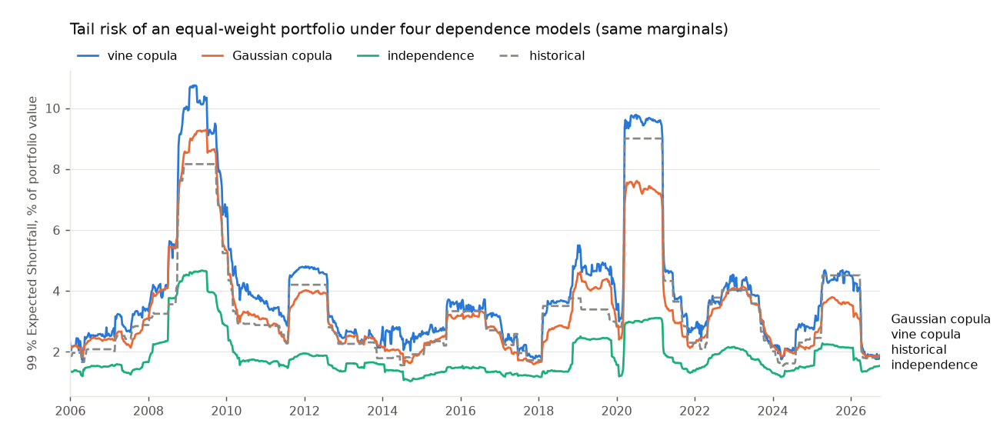

# Dynamic Vine Copula Risk Monitoring

[](https://github.com/DanielWolff2001/Quant_copula/actions/workflows/ci.yml)
[](https://danielwolff2001.github.io/Quant_copula/)

A quantitative risk framework for estimating and monitoring time-varying dependence
structures in financial markets using rolling vine copula models.

The project investigates how pairwise and higher-order dependence, particularly
tail dependence, evolves over time and whether statistically meaningful changes in
the dependence structure can be detected. The resulting dependence models are
subsequently used to investigate implications for portfolio tail risk.

It is a research project, **not a trading strategy**. All ten phases of the project plan are implemented, tested
(about 180 automated tests) and documented. **Full documentation: <https://danielwolff2001.github.io/Quant_copula/>**
(the same pages are in `docs/`).

## Quick start

```bash
git clone https://github.com/DanielWolff2001/Quant_copula.git
cd Quant_copula
python3.12 -m venv .venv && source .venv/bin/activate        # Python 3.11 or newer
pip install -e ".[dev,dashboard,notebooks]"
pytest                                                       # about two minutes

vine-risk run --last 700 --refit-frequency 5 --run-dir data/results/demo   # a first run, ~2 minutes
vine-risk dashboard --run-dir data/results/demo                            # explore it
jupyter lab                                                                # six tutorial notebooks in notebooks/
```

`vine-risk run` alone does the full 20-year analysis (about an hour and a quarter on 4 cores; interrupt and resume at will).
`vine-risk update` keeps a run current with new prices and `vine-risk schedule` prints a cron / launchd / systemd entry for it.
New to Python projects with many folders? [Getting started](docs/getting-started.md) and the [notebooks](docs/notebooks.md) explain everything,
including what `pyproject.toml` is.

## 1. Methodology

```
adjusted prices -> log returns -> rank transform (uniform marginals) -> vine copula on a 250-day window
     -> slide the window, refit -> dependence metrics, change detection, portfolio risk
```

* **Returns, not prices.** Log returns of adjusted prices; marginals are turned into uniforms by ranks (default) or by a
  GARCH(1,1) filter that removes volatility clustering first (`rolling.marginal: garch_t`), behind one interface.
* **Vine copulas** from [pyvinecopulib](https://vinecopulib.github.io/pyvinecopulib/): the structure and a family for every
  pair-copula are chosen by BIC; the first three trees are fitted (a setting).
* **Three levels, kept apart:** dependence (Kendall's tau, tail dependence), vine structure (families, edges), and
  *structural change*, because most changes in a rolling fit are estimation noise.
* **No look-ahead.** The result for a day uses only data up to that day; the live monitor reproduces the batch results exactly.

## 2. Architecture

The reusable code is a Python package, `src/vine_risk/`, in four layers: models (`copula`, `rolling`), analysis
(`change_detection`, `portfolio`), operations (`runner`, `update`, `monitor`, `cli`) and presentation (dashboard, notebooks).
A **run folder** (`data/results/w250/`) of tables, a checkpoint of fits and a `manifest.json` is the interface between them;
it records the code version, settings and data behind every result, and a run is only extended if those match.
Pinned versions are in `requirements-lock.txt`. [How it fits together](docs/architecture.md) · [Reproducibility](docs/reproducibility.md)

## 3. Example: dependence evolution


Eight liquid assets (AAPL, MSFT, NVDA, JPM, XOM, JNJ, SPY, TLT), daily data 2005-2026. Average dependence is low in 2006-07,
rises through the 2008 crisis and again in 2020, and has fallen to about a third of its peak by 2026. These are associations in the
sample, not causal claims.

## 4. Structural-change detection


The test asks whether the dependence in the latest window differs from the previous window by more than noise alone would
explain (it shuffles blocks of days between the two windows). On simulated data with a known answer, it flags about 1 % of
dates when nothing changes, also with clustered volatility, and detects a correlation jump (0.3 to 0.7) on 94 % of the dates where
the windows straddle it, typically half a window after it happens. Comparing consecutive days, z-scores and CUSUM are weaker or
mis-calibrated, and moderate changes confined to the tails are not detectable with a year of data. On the real data, dependence
differs significantly from the year before on about 40 % of scan dates, with modest effect sizes (typically 1.6 times the
no-change level); the live monitor turns this into about one alert episode every two years.
[Method](docs/methodology.md) · [Validation study](docs/validation.md)

## 5. Portfolio-risk implications



With the same marginals, ignoring dependence understates the 99 % Expected Shortfall by about a fifth in a calm window and by a factor
of two to three in 2008 and 2020; a Gaussian copula, which has no tail dependence, lies in between. A next-day VaR backtest over 1,045
dates gives exceedance rates of 0.96 % (vine copula), 1.5 % (Gaussian copula), 1.6 % (historical simulation) and 5.6 % (independence)
against an expected 1 %; with about ten exceedances, the vine is not significantly better than the Gaussian copula or historical
simulation. Most of the variation of tail risk over time comes from volatility, with dependence a smaller but real part.

## 6. Limitations

* A rolling window describes *local* history; financial dependence is not stationary.
* Different vine structures have almost the same likelihood, so family labels change often; levels (tau, tail coefficients) are
  more reliable than labels.
* Many dates and pairs are examined, so some "significant" changes occur by chance; effect sizes and corrected flags are reported.
* Realistic tail-only changes are hard to detect with 250 or 500 daily observations, so a non-significant tail test is weak evidence.
* A detected statistical change is not an economic regime change, and associations are not causes.
* The comparison models are few and simple (Gaussian copula, independence, historical simulation); GARCH-based and extreme-value
  models were not compared. Daily data only.

[All limitations](docs/limitations.md)

## Documentation and licence

[Getting started](docs/getting-started.md) · [Concepts](docs/concepts.md) · [Command line](docs/cli.md) ·
[Daily updates](docs/daily-update.md) · [Notebooks](docs/notebooks.md) · [Dashboard](docs/dashboard.md) ·
[API reference](docs/api/index.md) · [Changelog](CHANGELOG.md). MIT licence, see `LICENSE`.
