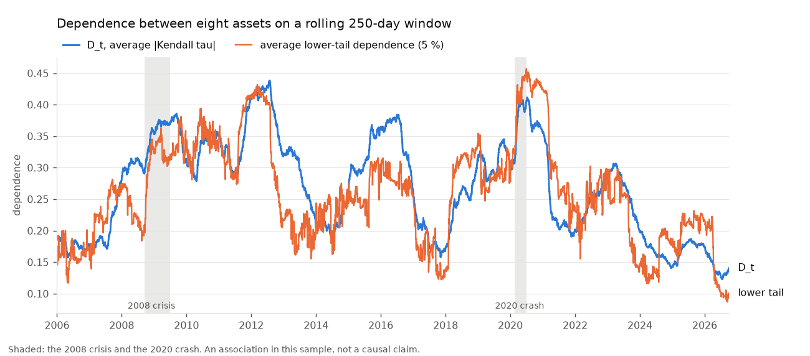

# Dynamic Vine Copula Risk Monitoring

A quantitative risk framework for estimating and monitoring time-varying dependence structures in financial markets using rolling
vine copula models.

The project investigates how pairwise and higher-order dependence, particularly tail dependence, evolves over time and whether
statistically meaningful changes in the dependence structure can be detected. The resulting dependence models are subsequently used
to investigate implications for portfolio tail risk. It is a research project, **not a trading strategy**.

## What it does

* **Estimates** a vine copula on a rolling window (250 days by default) of daily returns, for any list of tickers.
* **Tracks** dependence over time: average and pairwise Kendall's tau, tail dependence, the chosen pair-copula families, the vine structure.
* **Detects change** with a calibrated permutation test that separates real shifts from estimation noise, and validates the
  method on simulated data where the truth is known.
* **Measures tail risk** (Value at Risk, Expected Shortfall) from the fitted dependence and shows how it moves with dependence.
* **Runs day by day**: a live monitor with alerts, a daily-update command for a scheduler, a dashboard and notebooks.

## Where to start

| If you want to ... | go to |
|--------------------|-------|
| install it and run something | [Getting started](getting-started.md) |
| learn what the pieces do, step by step | [Notebooks](notebooks.md) |
| understand the ideas without the maths | [Concepts](concepts.md) |
| run it every day on new prices | [Daily updates](daily-update.md) |
| see every command | [Command line](cli.md) |
| know how far to trust the results | [Validation study](validation.md), [Limitations](limitations.md) |
| find a function | [API reference](api/index.md) |

## Status

All ten phases of the project plan are implemented, tested (about 180 automated tests) and documented.

| Phase | Content |
|------|---------|
| 1-2 | data download, cleaning, log returns; rank-based marginals with an interface for parametric ones |
| 3-4 | static vine copula; rolling estimation (checkpointed, parallel, incremental) |
| 5-6 | dependence monitoring metrics; structural change detection |
| 7 | portfolio risk (VaR, Expected Shortfall) and a VaR backtest |
| 8 | synthetic validation study |
| 9-10 | dashboard; simulated live monitor, now with a real daily-update command |
| extra | GARCH-filtered marginals, ten-model risk comparison with backtests ([results](benchmarks.md)), GARCH-filtered change scan |

!!! warning "Reading the results"
    Detected changes are statistical, not necessarily economic regime changes, and the associations found (for example higher dependence
    in crisis years) are not causal claims. Tail-only changes of realistic size are hard to detect with a year of daily data. See
    [Limitations](limitations.md).
